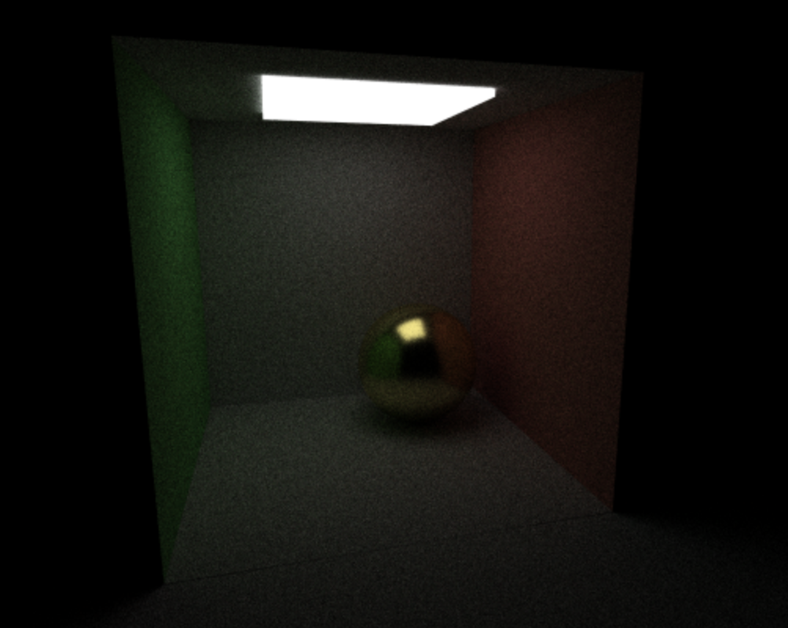
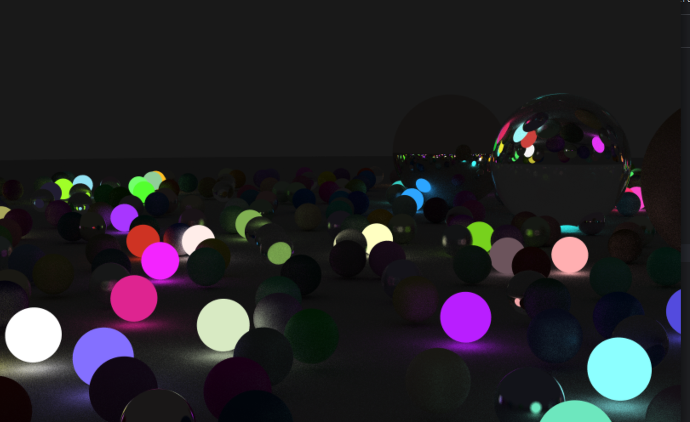
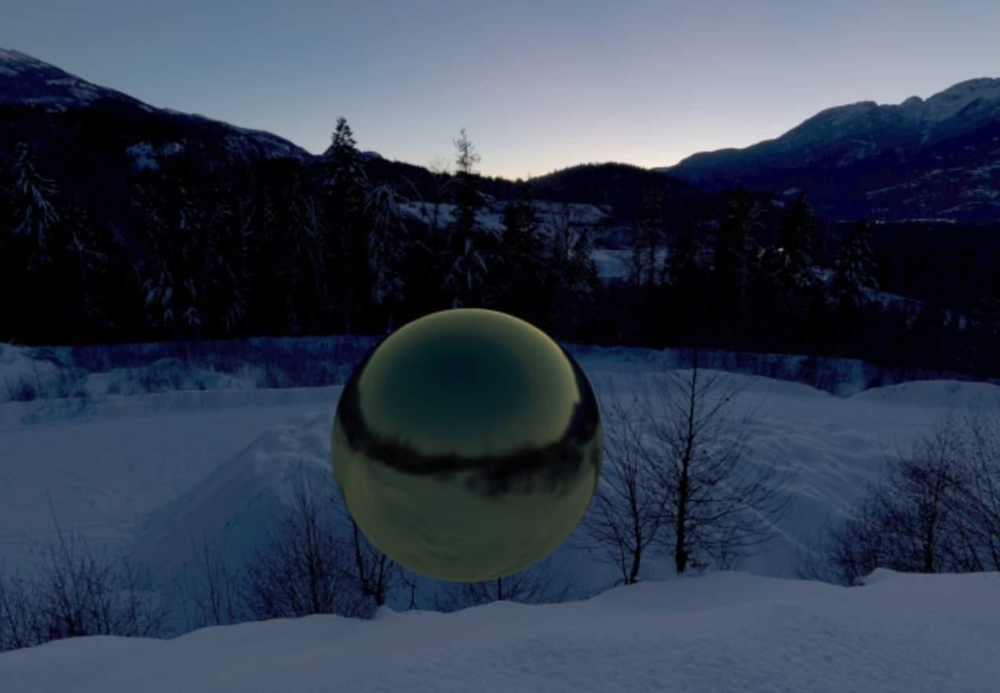

# Collection
This project is where I explored CPU-based ray tracing and real-time rendering techniques.  
It’s a playground to understand how raytracing works and to experiment with rendering algorithms.

  
  
  

